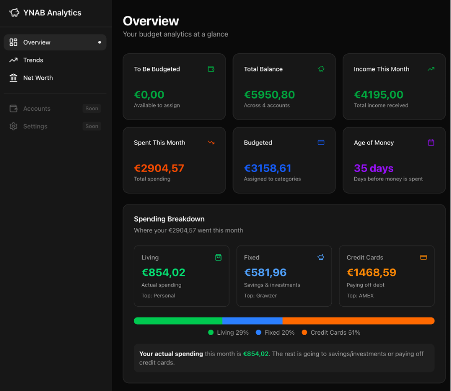
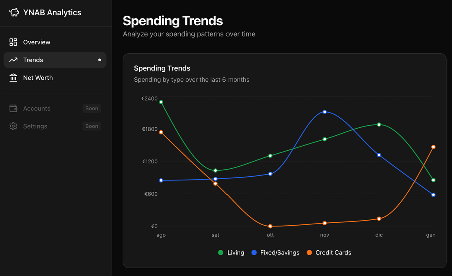
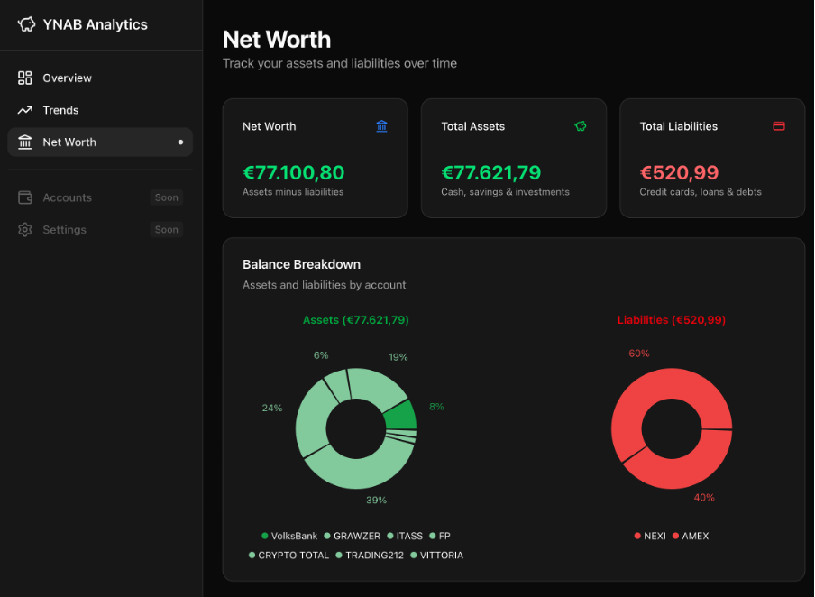

# YNAB Analytics Dashboard

A Next.js dashboard for visualizing your [YNAB](https://www.ynab.com/) budget data.



## Features

- **Overview** — Budget summary, spending breakdown by category, account balances
- **Trends** — Monthly spending patterns and category comparisons
- **Net Worth** — Assets vs liabilities breakdown with pie charts

<details>
<summary>More screenshots</summary>




</details>

## Setup

1. Clone the repo
2. Get your YNAB API key from [YNAB Developer Settings](https://app.ynab.com/settings/developer)
3. Configure environment:

```bash
cd dashboard
cp .env.example .env.local
```

Edit `.env.local`:
```
YNAB_API_KEY=your_api_key
YNAB_BUDGET_ID=your_budget_id
```

> 💡 Find your budget ID in the YNAB URL: `app.ynab.com/{budget_id}/budget`

4. Install and run:

```bash
npm install
npm run dev
```

Open [http://localhost:3000](http://localhost:3000)

## Tech Stack

- Next.js 15 (App Router)
- Tailwind CSS
- shadcn/ui
- Recharts
- YNAB API
